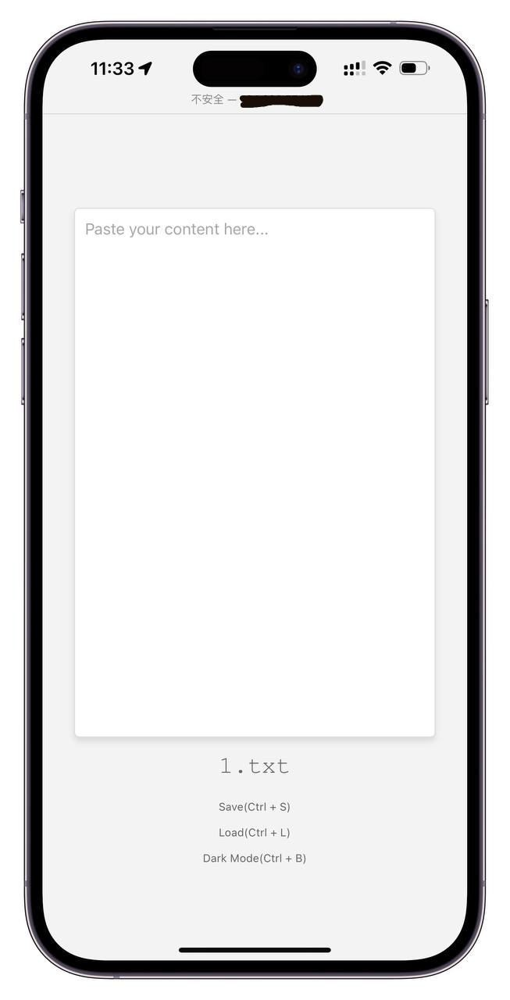

## 在线剪切板

<details>
<summary>源码部署(点击展开)</summary>

1. git clone 本项目到服务器
2. 进入 `allnode_version/` 目录下
3. 安装 node 环境 
4. 执行 `npm install` 安装依赖
3. 使用命令 `node api.js` 启动服务
4. 访问 `http://<你的服务器ip>:3000` 即可使用剪切版

```SH
#!/bin/bash
# 1. git clone 本项目到服务器
git clone https://github.com/cornradio/webclipboard

# 进入 `allnode_version/` 目录下
cd webclipboard/allnode_version

# 检查 Node.js 是否已经安装
if ! command -v node &> /dev/null; then
    echo "Node.js 未安装，请先安装 Node.js"
    exit 1
fi

# 4. 执行 `npm install` 安装依赖
npm install

# 5. 使用命令 `node api.js` 启动服务
node api.js &  # 使用 & 让服务在后台运行

# 6. 访问 `http://<你的服务器ip>:3000` 即可使用剪切版
echo "服务已启动，请访问 http://<你的服务器ip>:3000 使用剪切版"
```
</details>


docker部署：参考 [allnode_version](allnode_version/README.md)  


## 截图


<div align="center">
	
</div>


## 历史记录功能
- 使用 `localStorage` 保存本地访问过的文件名历史记录
- 通过鼠标移动到网页左上角的方式查看历史记录
  


## 命令行使用（curl命令）

`uploadtxt.sh` 可以上传 `a.json` 文件到服务器 `1.txt` 文件中
```shell
curl \
-X POST http://<your-ip>/api/writefile/1.txt \
-H "Content-Type: application/json" \
-d "{\"content\": \"$(awk '{printf "%s\\n", $0}' a.json | sed 's/"/\\"/g')\"}"
```


## 类似tool
https://fagedongxi.com/  
https://getnote.top/  
https://hackmd.io/?nav=overview
