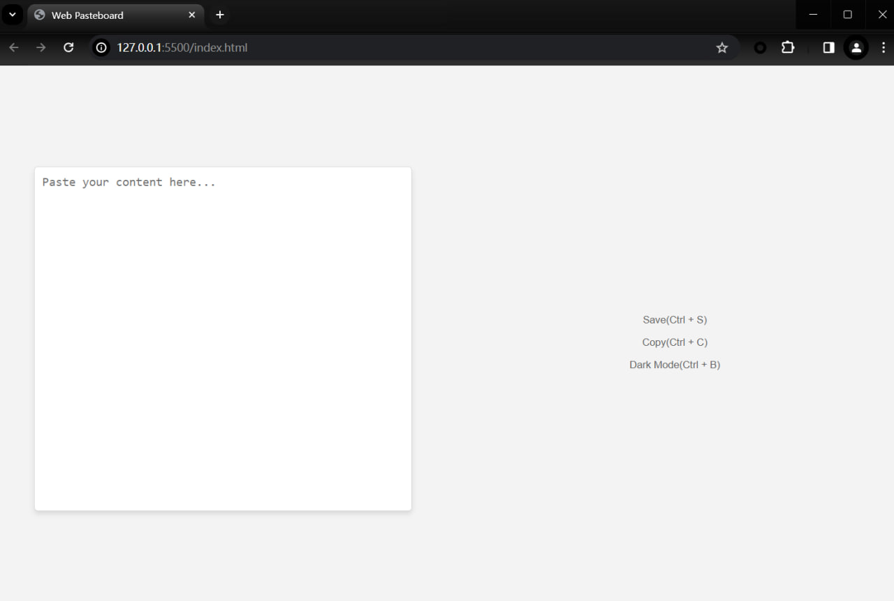

# how to use
1. clone this project
2. open the project in vscode
3. open with live server
4. change 1.txt == cange the text in the browser
5. `ipconfig /all |findstr IPv4` , 192.168.31.10:5500 open on your phone

